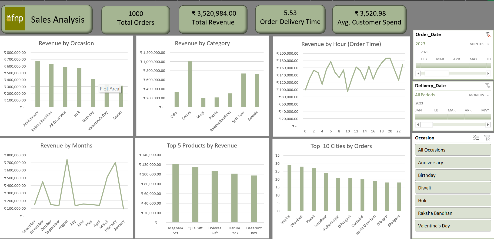

# **Ferns and Petals Sales Analysis**

## 📌*Project Overview*

This project provides an end-to-end sales analysis for Ferns and Petals, a leading online gifting platform, focusing on trends, product performance and customer insights. The analysis involved data cleaning, transformation, modeling, and business intelligence dashboard development in MS Excel, culminating in actionable reporting for business stakeholders.

## 🔍 *Business Questions*

- What is the company’s total revenue and average customer spend?

- How does revenue vary by occasion, product category and month?

- Which products and cities drive the most revenue?

- What are the key trends in order volume and delivery time?

*Detail: Full business problem statement and questions are provided in the attached **Ferns-and-Petals-Sales-Analysis.pdf**.*

## 📊 *Dataset*
The project dataset includes 1000 sales orders from 2023, with the following files:

- customers.csv: Customer demographic details

- products.csv: Product catalog data

- orders.csv: Detailed order transactions (including dates, products, categories, and locations)

## 🛠️ *Tools & Libraries*

- Microsoft Excel (Power Query, Pivot Tables, DAX)

- Data Visualization: Excel dashboard, charts

## 📈 *Approach*

- **Data Understanding**: Explored structure, fields and context of raw data from customers, products and orders files.

- **Data Cleaning & Transformation**: Leveraged Power Query in Excel to handle missing values, filter data and unify date formats.

- **Data Modeling**: Established relationships and built a data model to support robust analysis across fact and dimension tables.

- **Data Analysis**: Used Pivot Tables and DAX for in-depth exploration of sales, customer and temporal trends.

- **Data Visualization & Dashboarding**: Designed an interactive Excel dashboard to visualize key performance metrics and enable drill-down analysis.

- **Report Writing**: Summarized findings and recommendations in a structured consulting report for business stakeholders.

## 🔍 *Key Findings*

- The company’s total revenue for 2023 was ₹35,20,984 with an average customer spend of ₹3,520.98 per order.
  
- Revenue varies significantly by occasion, with Anniversary, Raksha Bandhan and Holi being the top revenue-generating occasions.
  
- Soft Toys and Sweets are the leading product categories in terms of revenue.
  
- Revenue also fluctuates by month, with noticeable spikes in February and December.
  
- The top products driving revenue are the Magnam Set, Exercitationem Pack, and Expedita Gift.
  
- Kavali is the top-performing city in terms of order volume.
  
- The average order-to-delivery time is 5.53 days.

### Additional Quantifiable Insights:

- Sales in February increased by approximately 39% compared to January, indicating a strong start to the year.
  
- Revenue in December peaked at nearly ₹80,000, about 33% higher than November, highlighting holiday season spikes.
  
- The top product "Magnam Set" generated around ₹120,000, contributing roughly 20% of total revenue.
  
- Kavali recorded 7 orders, making it the city with the highest order count.

### Negative Insights:

- The order-to-delivery time of 5.7 days is relatively high, posing risks for perishable goods like flowers and gifts which require timely delivery.
  
- Sales dipped noticeably in months like April and September, indicating potential seasonal weaknesses or marketing gaps.
  
- The oldest products and categories show slower revenue growth, suggesting a need to refresh offerings or target newer customer segments.
  
- Some of the top cities had only 3-4 orders, highlighting regional opportunity gaps.

## ✅ *Recommendations*

- **Enhance Marketing for Peak Occasions:** Allocate more marketing budget and campaigns around high-revenue occasions like Anniversary, Raksha Bandhan and Holi to maximize sales impact.

- **Leverage Seasonal Spikes:** Prepare inventory and promotional strategies for months with sales spikes, especially February and December, to capitalize on demand surges.

- **Expand High-Performing Categories:** Increase focus on Soft Toys and Sweets categories through bundle offers and targeted promotions, given their strong revenue contributions.

- **Optimize Delivery Operations:** Reduce the average order-to-delivery time from 5.7 days to improve customer satisfaction, especially for perishable and time-sensitive products.

- **Address Seasonal Sales Dips:** Investigate causes for revenue dips in months like April and September through market research and adjust marketing efforts accordingly.

- **Refresh Product Portfolio:** Evaluate slow-growing products and categories for refreshing or phasing out and focus on introducing innovative offerings to attract new customer segments.

- **Geographical Expansion:** Target cities with low order volumes via localized promotions and partnerships to broaden market presence beyond top-performing cities like Kavali.

- **Monitor Top Product Performance:** Maintain inventory and availability of best-selling products such as the Magnam Set to avoid stockouts and lost sales.

## *Dashboard*

